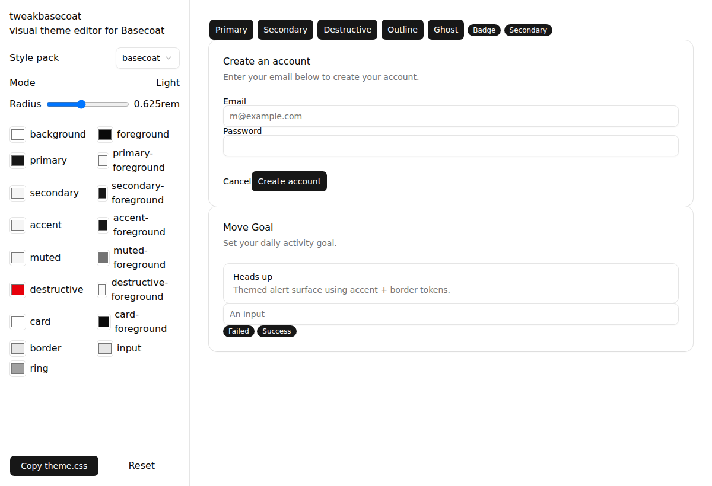

# tweakbasecoat

A visual theme editor for [Basecoat](https://basecoatui.com/) — the spiritual equivalent of
[tweakcn](https://tweakcn.com/), but aimed at Basecoat instead of React shadcn/ui.

Edit colors, radius, and dark/light mode against a live Basecoat preview, then copy a
ready-to-paste `theme.css`. No build step, no framework, no server — one static HTML file.



## Why this exists

Basecoat and tweakcn both descend from shadcn/ui's CSS-variable convention
(`--primary`, `--background`, `--radius`, `:root` + `.dark`). tweakcn's output is already
~drop-in for Basecoat — but its **live preview renders React shadcn components**, so it can't
show you your theme on Basecoat's actual HTML class API (`class="btn btn-secondary"`), and it
knows nothing about Basecoat's style packs (vega, nova, maia, …).

tweakbasecoat fills exactly that gap: the preview is real Basecoat markup, and you can switch
style packs live.

## How it works

The entire theming engine is tiny and framework-free — three steps:

1. **token object** — colors/radius for `light` + `dark` (`app.js`)
2. **apply** — `root.style.setProperty('--token', value)` onto `:root`; the preview re-themes
   for free via the CSS cascade (lifted from tweakcn's 69-line `applyThemeToElement`)
3. **export** — serialize the token object to a `:root {}` / `.dark {}` block

Color math is [culori](https://culorijs.org/) (the same library tweakcn uses), loaded as a
browser ESM module. UI reactivity is [Alpine.js](https://alpinejs.dev/) — which is also
Basecoat's recommended JS pairing. Basecoat itself loads from a self-contained jsDelivr CDN
bundle, swapped at runtime when you change style pack.

```
index.html   preview (Basecoat HTML) + controls panel (Alpine)
app.js        token store · apply (setProperty) · culori conversion · export
app.css       editor layout chrome only — components are styled by Basecoat
```

## Run

No install. Open `index.html` over any static server (CDN modules need http, not `file://`):

```sh
python3 -m http.server 8000
# then open http://localhost:8000
```

Append `#selftest` to the URL to run the conversion/serialization self-check in the console.

## Usage

1. Pick a style pack and light/dark mode.
2. Tweak color swatches and the radius slider — the preview updates live.
3. **Copy theme.css** and paste it into your Basecoat project after the Basecoat import:

```css
@import "tailwindcss";
@import "basecoat-css";   /* or basecoat-css/sera, etc. */
@import "./theme.css";    /* <- paste here; last import wins */
```

## Status

Proof-of-concept spike. Working: live theming, pack switching, dark/light, culori conversion,
`theme.css` export. Not yet built: typography/font controls, shadow editor, chart + sidebar
token groups, import-existing-theme, shareable URLs, the full multi-tab demo gallery.
